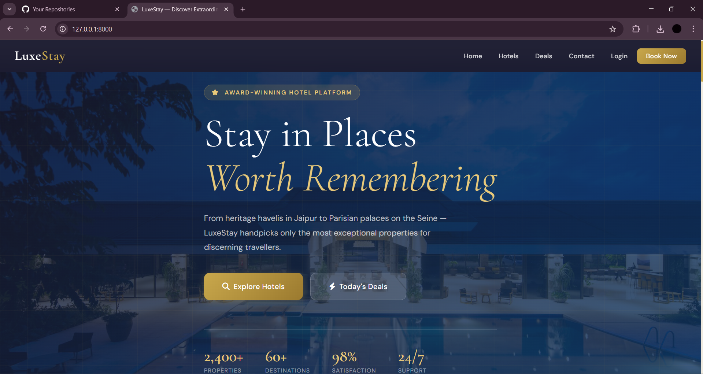
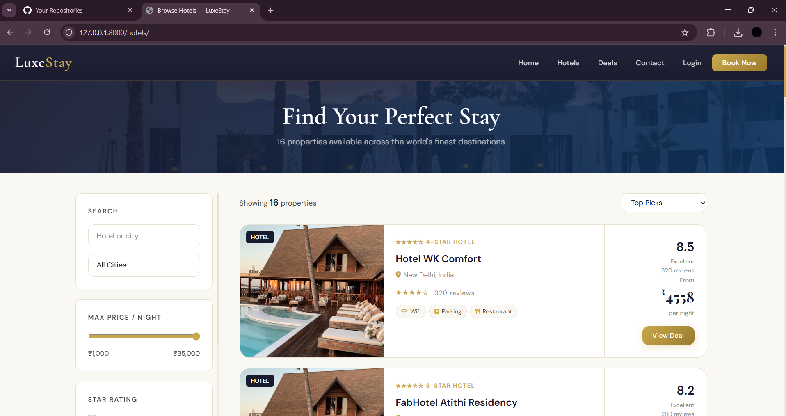
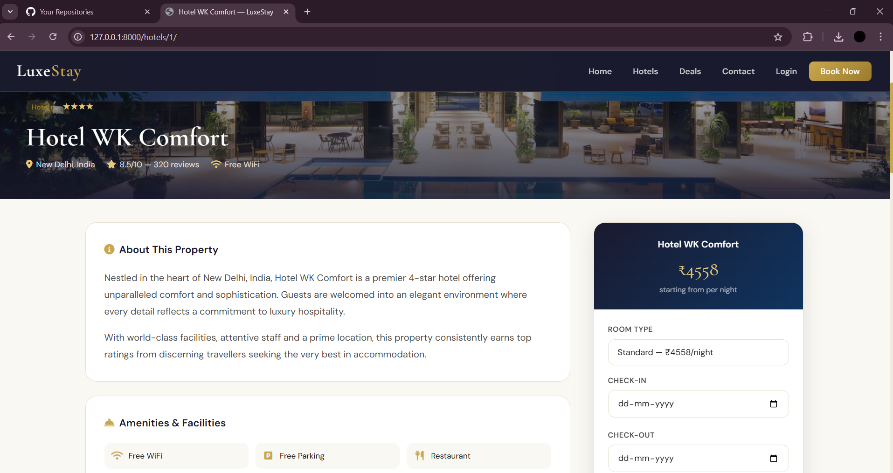
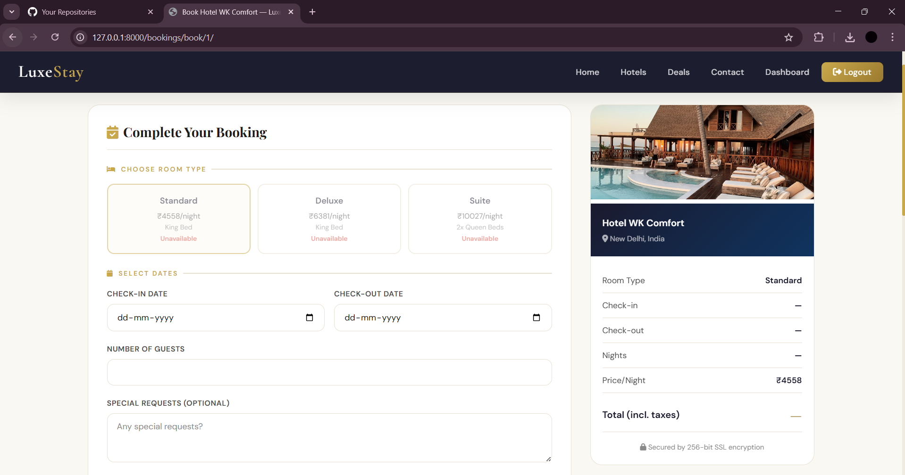
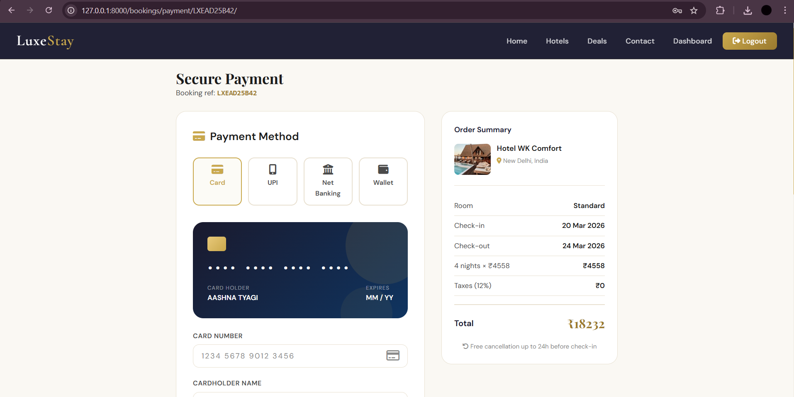
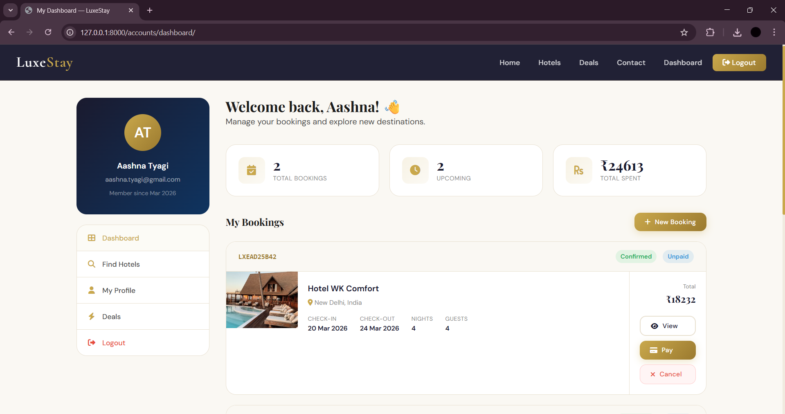

# 🏨 LuxeStay — Django Hotel Booking System

<div align="center">


**A full-stack luxury hotel booking platform built with Django, Django REST Framework, and a custom gold/charcoal design system.**

[Features](#-features) • [Screenshots](#-screenshots) • [Installation](#-installation) • [API Docs](#-rest-api) • [Project Structure](#-project-structure) • [Author](#-author)

</div>

---

## 📸 Screenshots

### 🏠 Homepage
<p align="center">
  
</p>

### 🏨 Hotels Listing & Filters
<p align="center">
  
</p>

### 🏩 Hotel Detail Page
<p align="center">
  
</p>

### 📅 Booking Page
<p align="center">
  
</p>

### 💳 Payment Page
<p align="center">
  
</p>

### 📊 User Dashboard
<p align="center">
  
</p>

---

## ✨ Features

- **Luxury UI** — Cormorant Garamond + Playfair Display typography, gold & charcoal palette, smooth animations
- **User Authentication** — Register, login, logout, profile management with Django's built-in auth
- **Hotel Browsing** — Search and filter by city, price, star rating, property type and facilities
- **Full Booking Flow** — Room selection → Date picker → Confirmation → Payment → Cancellation
- **User Dashboard** — View booking history, stats, upcoming stays and spending summary
- **REST API** — 14 fully documented endpoints via Django REST Framework with Token authentication
- **Django Admin** — Full admin panel to manage hotels, rooms, users and bookings
- **Responsive Design** — Mobile-first layout that works on all screen sizes

---

## 🆚 Flask vs Django — What Changed

| Feature | Flask (Original) | LuxeStay (Django) |
|---|---|---|
| Framework | Flask | Django 4.2 |
| Authentication | Flask-Login | Django built-in + Token Auth |
| ORM | Flask-SQLAlchemy | Django ORM |
| REST API | ❌ None | ✅ Django REST Framework |
| Admin Panel | ❌ None | ✅ Full Django Admin |
| Password Security | Flask-Bcrypt | Django PBKDF2 |
| CSRF Protection | Manual | ✅ Built-in |
| UI | Basic HTML/CSS | ✅ Luxury design system |

---

## ⚙️ Installation

### 1. Clone the Repository

```bash
git clone https://github.com/YOUR_USERNAME/luxestay-django.git
cd luxestay-django
```

### 2. Create Virtual Environment

```bash
python -m venv env

# Windows
env\Scripts\activate

# Mac / Linux
source env/bin/activate
```

### 3. Install Dependencies

```bash
cd luxestay
pip install -r requirements.txt
```

### 4. Run Migrations

```bash
python manage.py makemigrations accounts hotels bookings
python manage.py migrate
```

### 5. Create Superuser (Admin Access)

```bash
python manage.py createsuperuser
```

### 6. Start the Server

```bash
python manage.py runserver
```

Open **http://127.0.0.1:8000** in your browser.

---

## 🌐 URL Routes

| URL | Description |
|---|---|
| `/` | Homepage with featured hotels & destinations |
| `/hotels/` | Browse & filter all hotels |
| `/hotels/<id>/` | Hotel detail page with rooms & reviews |
| `/deals/` | Deals of the day with live countdown |
| `/contact/` | Contact page |
| `/accounts/register/` | User registration |
| `/accounts/login/` | Login |
| `/accounts/dashboard/` | User booking dashboard |
| `/accounts/profile/` | Edit profile |
| `/bookings/book/<id>/` | Book a hotel |
| `/bookings/confirmation/<ref>/` | Booking confirmed page |
| `/bookings/payment/<ref>/` | Payment page |
| `/bookings/cancel/<ref>/` | Cancel a booking |
| `/admin/` | Django admin panel |

---

## 🔌 REST API

Base URL: `http://127.0.0.1:8000/api/`

### Auth Endpoints

| Method | Endpoint | Description |
|---|---|---|
| `POST` | `/api/auth/register/` | Register a new user, returns token |
| `POST` | `/api/auth/login/` | Login, returns auth token |
| `POST` | `/api/auth/logout/` | Logout, invalidates token |
| `GET/PATCH` | `/api/auth/profile/` | View or update profile |

### Hotel Endpoints

| Method | Endpoint | Description |
|---|---|---|
| `GET` | `/api/hotels/` | List all hotels (supports filters) |
| `GET` | `/api/hotels/<id>/` | Hotel details + room options |
| `GET` | `/api/hotels/featured/` | Featured hotels only |
| `GET` | `/api/hotels/deals/` | Best price hotels |
| `GET` | `/api/hotels/<id>/availability/` | Check room availability |
| `GET` | `/api/cities/` | List all available cities |

### Booking Endpoints (Auth Required)

| Method | Endpoint | Description |
|---|---|---|
| `GET` | `/api/bookings/` | List user's bookings |
| `POST` | `/api/bookings/` | Create a new booking |
| `GET` | `/api/bookings/<ref>/` | Get single booking details |
| `DELETE` | `/api/bookings/<ref>/` | Cancel a booking |

### Quick API Test

```bash
# Get all hotels
curl http://127.0.0.1:8000/api/hotels/

# Register
curl -X POST http://127.0.0.1:8000/api/auth/register/ \
  -H "Content-Type: application/json" \
  -d '{"email":"test@test.com","first_name":"Test","last_name":"User","mobile":"9999999999","password":"Test1234!","confirm_password":"Test1234!"}'

# Login and get token
curl -X POST http://127.0.0.1:8000/api/auth/login/ \
  -H "Content-Type: application/json" \
  -d '{"email":"test@test.com","password":"Test1234!"}'
```

---

## 📁 Project Structure

```
luxestay_django/
│
├── Screenshots/                    # Application screenshots
│   ├── home.png
│   ├── hotels.png
│   ├── detail.png
│   ├── booking.png
│   ├── payment.png
│   └── dashboard.png
│
├── README.md
│
└── luxestay/                       # Django project root
    │
    ├── accounts/                   # User auth app
    │   ├── models.py               # Custom User model
    │   ├── views.py                # Register, login, dashboard, profile
    │   ├── forms.py                # Register & login forms
    │   └── urls.py
    │
    ├── hotels/                     # Hotels app
    │   ├── models.py               # Hotel, Room, Review, Amenity
    │   ├── views.py                # Home, listing, detail, deals
    │   └── urls.py
    │
    ├── bookings/                   # Bookings app
    │   ├── models.py               # Booking model
    │   ├── views.py                # Book, confirm, pay, cancel
    │   ├── forms.py                # Booking form with validation
    │   └── urls.py
    │
    ├── api/                        # REST API app
    │   ├── serializers.py          # DRF serializers
    │   ├── views.py                # API views & endpoints
    │   └── urls.py
    │
    ├── templates/                  # All HTML templates
    │   ├── base.html               # Base layout with navbar & footer
    │   ├── accounts/
    │   │   ├── login.html
    │   │   ├── register.html
    │   │   ├── dashboard.html
    │   │   └── profile.html
    │   ├── hotels/
    │   │   ├── home.html
    │   │   ├── hotel_list.html
    │   │   ├── hotel_detail.html
    │   │   ├── deals.html
    │   │   └── contact.html
    │   └── bookings/
    │       ├── booking.html
    │       ├── confirmation.html
    │       ├── payment.html
    │       └── cancel.html
    │
    ├── luxestay/                   # Django project config
    │   ├── settings.py
    │   ├── urls.py
    │   └── wsgi.py
    │
    ├── manage.py
    ├── requirements.txt
    └── db.sqlite3
```

---

## 🛠️ Tech Stack

| Layer | Technology |
|---|---|
| Backend | Python 3.12, Django 4.2 |
| REST API | Django REST Framework 3.14 |
| Database | SQLite (dev) |
| Frontend | HTML5, CSS3, Vanilla JS |
| Fonts | Cormorant Garamond, Playfair Display, DM Sans |
| Icons | Font Awesome 6.5 |
| Auth | Django Auth + DRF Token Auth |

---

## 📌 Future Improvements

- [ ] Razorpay / PayPal real payment integration
- [ ] Email confirmation via SMTP
- [ ] JWT authentication for API
- [ ] Google Maps embed for hotel location
- [ ] Hotel image uploads via Django media
- [ ] Redis caching for hotel listings
- [ ] Docker + Nginx deployment config
- [ ] Unit tests with pytest-django

---

## 👩‍💻 Author

**Aashna Tyagi**

- 📧 Email: [aashna.tyagi@gmail.com](mailto:aashna.tyagi@gmail.com)
- 📱 Phone: +91 74196 09322
- 🐙 GitHub: [@AashnaTyagi](https://github.com/AashnaTyagi)

---

## 📜 License

This project is licensed under the **MIT License** — feel free to use, modify and distribute.

---

<div align="center">
  Made with ❤️ by <strong>Aashna Tyagi</strong> · © 2025 LuxeStay
</div>